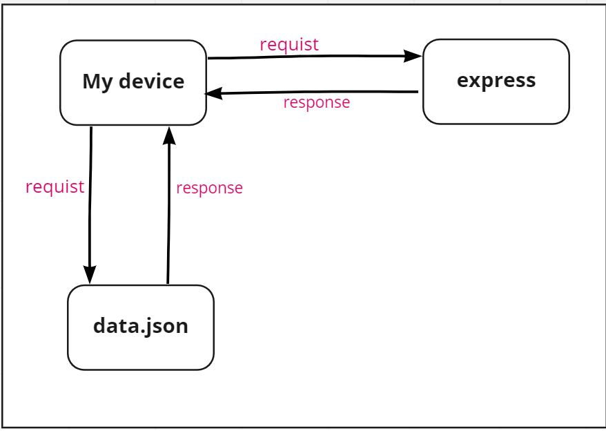

# Movies-Library 1.0.0

**Author Name**: sultan kanaan

## WRRC

## Overview
we are in the  Movies Library project

## Getting Started
- git clone git@github.com:sultan-kanaan/Movies-Library.git **in your Terminal**.
- npm install express.
- Code.
- Use Postman and 
http://localhost:3000 **to home page**
http://localhost:3000/favorite **to favorite page**

## Project Features
-Home Page Endpoint
-Favorite Page Endpoint
-page not found error